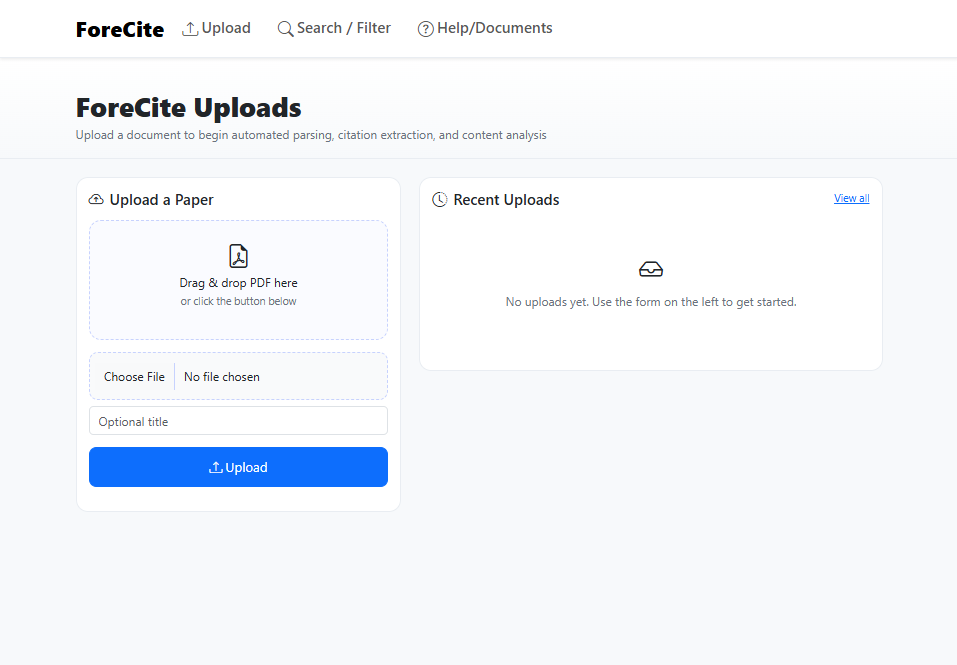
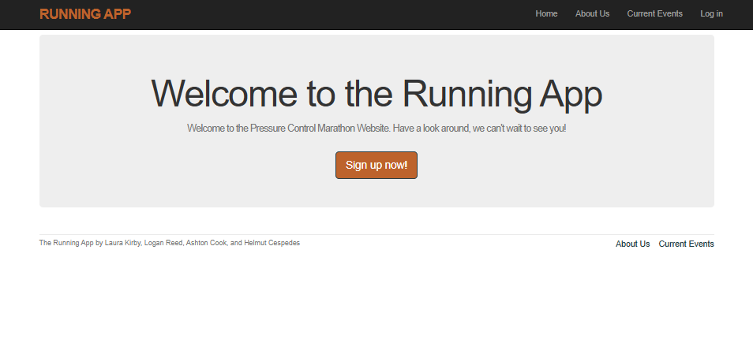

Portfolio
=========

Programming Projects
--------------------

*For access to my private project repositories, please [email me](mailto:helmut.cespedes@gmail.com?subject=GitHub%20Access) with the subject line, GitHub Access.

---
### [ForeCite Citation Parser | CSCI 496](project1)

---
### [Running app for Event| CSCI 334](project2)

---
### [Project 3 Title | CSCI 325](project1)

---
### [Project 4 Title | CSCI 332](project1)

---

Ethics Papers
-------------

### [Ethics of Artificial Intelligence](/pdf/AI.pdf)

-   **Class:** Datastructures and Algorithms
-   **Grade:** 100

### [Paper 2 Title](/pdf/copy.pdf)

-   **Class:** Survey of Scripting Languages
-   **Grade:** 100

### [Paper 3 Title](/pdf/sample_presentation.pdf)

-   **Class:** 
-   **Grade:**

---

Presentations
-------------

### [Presentation 1 Title](/pdf/HD.pdf)

- **Class:** Fundamentals of Artificial Intelligence
- **Grade:** 80%

### [Presentation 2 Title](/pdf/64bit.pdf)

- **Class:** Operating Systems
- **Grade:** NA

---

Page template forked from <a href="https://github.com/csu-cs/csci-portfolio">CSU-CS</a>

<!-- Remove above link if you don't want to attributive -->
