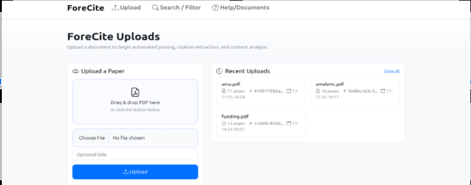
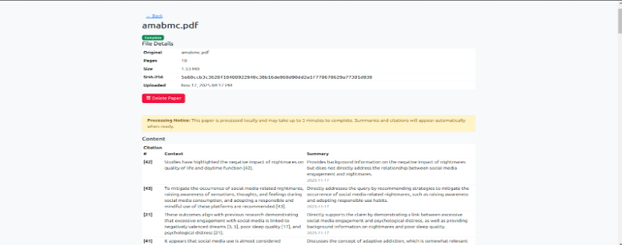
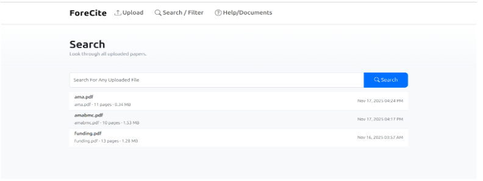
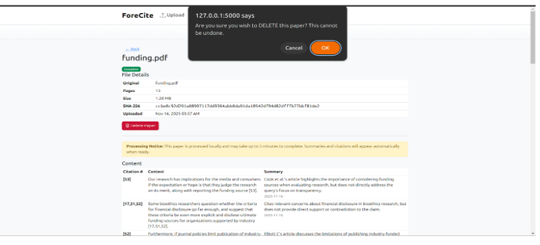

[Back to Portfolio](./)

Project 1 Title
===============

-   **Class:** CSCI 496
-   **Grade:** NA
-   **Language(s):** Python, HTML
-   **Source Code Repository:** [features/mastering-markdown](https://github.com/Helmut34/citation-summary-parser)  
    (Please [email me](mailto:examhelmut.cespedes@gmail.com?subject=GitHub%20Access) to request access.)

## Project description

The Medical University of South Carolina (MUSC) conducts extensive research that relies heavily on accurate citations and literature review. Currently, researchers and students must manually extract and organize citations from research papers, a process that is both time-consuming, resource-intensive, and error-prone. Given the volume of publications produced and reviewed by MUSC, this inefficiency creates delays in research workflows and increases the risk of inaccuracies in research at MUSC. To address this issue, this project applies the Systems Development Life Cycle (SDLC) to design and implement an automated citation extraction system. This solution will leverage a local Large Language Model (LLM) to identify citations, capture their context, and generate summaries of their relevance, with results stored in a structured database. By streamlining citation management, MUSC researchers will benefit from reduced administrative workload, greater accuracy, and improved efficiency.

## How to run the program

Included in Repository (See README and Requirements.txt)

```bash
cd ./frontend
python app.py
```


## UI Design

Usage Flow Included In Documentation

  
Fig 1. The launch screen

  
Fig 2. Example output after input is processed.

  
Fig 3. Example for Searching a document

  
Fig 3. Example for deleting a document


For more details see [GitHub Flavored Markdown](https://guides.github.com/features/mastering-markdown/).

[Back to Portfolio](./)