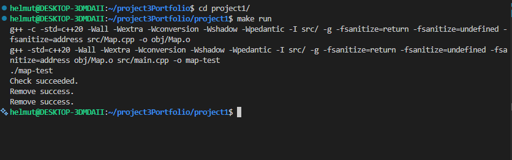
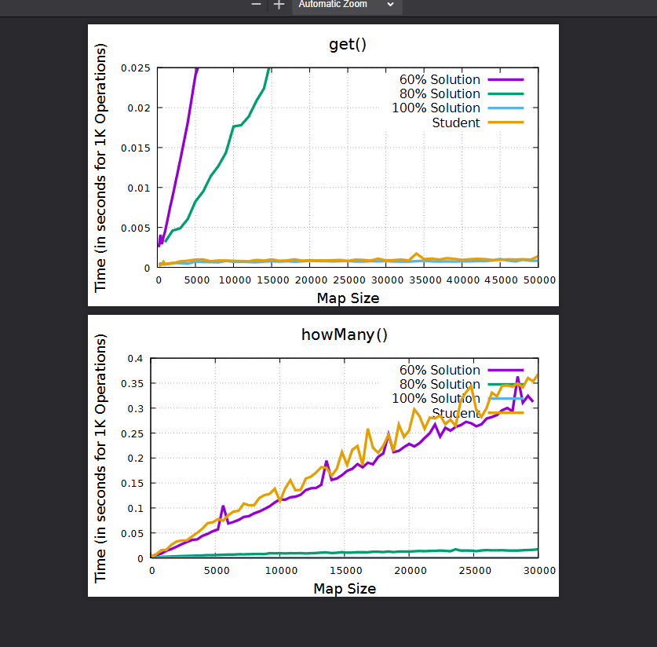

[Back to Portfolio](./)

Mapping Big Data
===============

-   **Class:** Datastructures and Algorithms
-   **Grade:** 100
-   **Language(s):** C++
-   **Source Code Repository:** [features/mastering-markdown](https://github.com/Helmut34/project3Portfolio-repo)  
    (Please [email me](mailto:helmut.cespedes@gmail.com?subject=GitHub%20Access) to request access.)

## Project description

Map Algorithm that stores student's first name, lastname and maps it to an ID. 
Constranames Consist of:
A unique constant contiguus sequence of char values that contains a first and a last name;

Between each first and last name there is a space;

Only the 26 letters of the english algphabet are used;

In the algorithm every students name maps to a single nonnegative 32-bit integer.

## How to compile and run the program

```bash
cd ./project1
make run
```


## UI Design

No UI Design, this project is mainly to develop an algorithm that can accurately and quickly pass the given testcases. Complexity and Time information provided after running.

  
Fig 1. The launch screen

  
Fig 2. Example Timing Output


## 3. Additional Considerations

Sed ut perspiciatis unde omnis iste natus error sit voluptatem accusantium doloremque laudantium, totam rem aperiam, eaque ipsa quae ab illo inventore veritatis et quasi architecto beatae vitae dicta sunt explicabo. 

For more details see [GitHub Flavored Markdown](https://github.com/Helmut34/project3Portfolio-repo).

[Back to Portfolio](./)