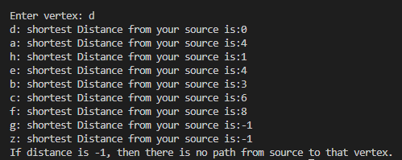

[Back to Portfolio](./)

Dijsktra Algorithm Console
===============

-   **Class:** Algorithms
-   **Grade:**  NA
-   **Language(s):** C++
-   **Source Code Repository:** [features/mastering-markdown](https://github.com/Helmut34/project4Portfolio-repo)  
    (Please [email me](mailto:helmut.cespedes@gmail.com?subject=GitHub%20Access) to request access.)

## Project description

Console Based Djstra Algorithm Implementation.

## How to compile and run the program

How to compile (if applicable) and run the project.

```bash
cd ./project2
make run
```

If the programming language does not require compilation, the update the heading to be “How to run the program.” If your application is deployed on a remote service, including instructions on how to deploy it.

## UI Design

Simple Console Design, After code is compiled the console outputs the matrix based on the verteces provided. Once the user enters a desired vetex to apply Djsktras algorithm to, the console outputs the distances.

  
Fig 1. The launch screen

  
Fig 2. Example output after input is processed.


For more details see [GitHub Flavored Markdown](https://github.com/Helmut34/project4Portfolio-repo).

[Back to Portfolio](./)